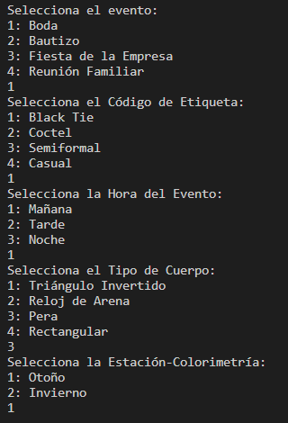
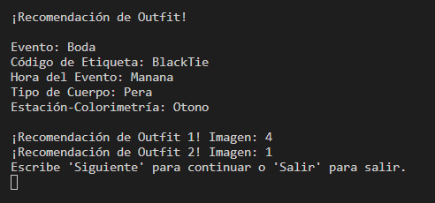
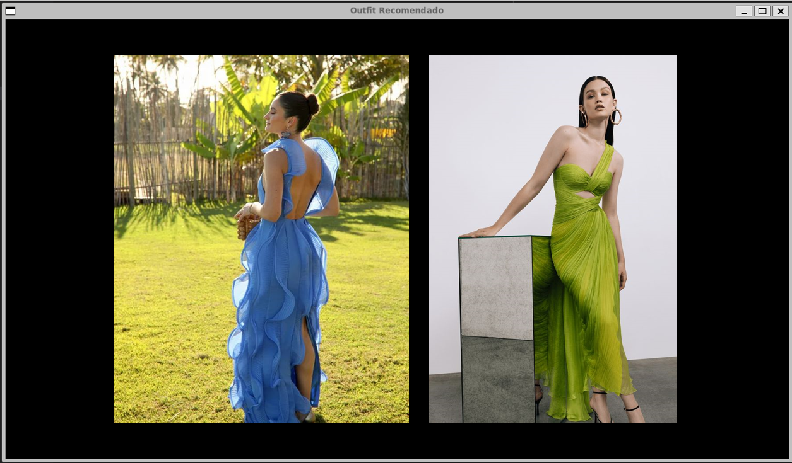
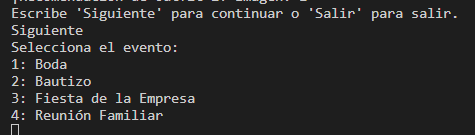
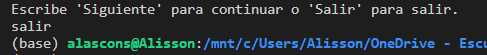

## Carpeta del proyecto
project_ac
### Autor: Alisson Constantine

## Ejecutar el programa

usando cargo:
- cd project_ac
- cargo run

al final:
cargo build --release

Las imágenes de los diferentes tipos de outfit están disponibles en el enlace: https://espolec-my.sharepoint.com/:f:/g/personal/alascons_espol_edu_ec/Eln67vO6uNRAgYG2rBTZdZoB9fGhlAB8uXCVBYuMUs3pqg?e=VR3lDm
Se debe acceder con la cuenta institucional. Se deben poner dentro de la carpeta static

## Características

Programa de Selección de Outfit para Eventos:
El programa funciona por consola y en su versión Beta muestra las opciones en una ventana de escritorio.
El algoritmo muestra las mejores 2 opciones de vestimenta para mujeres dependiendo del tipo de cuerpo, colorimétria, evento, hora y código de etiqueta del evento.

Tipos de Eventos Disponibles: 
- Boda
- Bautizo
- Fiesta de la Empresa
- Reunión Familiar

Códigos de Etiqueta Disponibles: 
- Black Tie
- Coctel
- Semiformal
- Casual

Hora del Evento:
- Mañana
- Tarde
- Noche

Tipo de Cuerpo: 
- Triángulo Invertido
- Reloj de Arena
- Pera
- Rectangular

Estación de Colorimetría:
- Otoño
- Invierno

## Ejemplos de Funcionamiento

A través de consola se permite la selección mostrando las opciones una a la vez.

Al final muestra el resultado, dando las opciones de imágenes ideal para el evento.

Y se abre una ventana mostrando las imágenes selccionadas.

Al finalizar da la opción para continuar con una nueva consulta, lo que muestra nuevamente las opciones.

O se puede presionar salir, lo que termina de ejecutar el programa.
